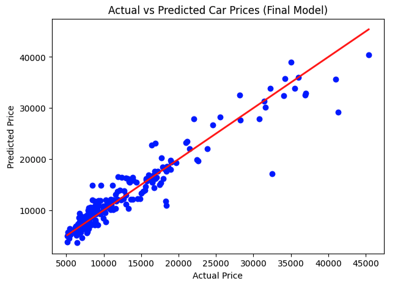
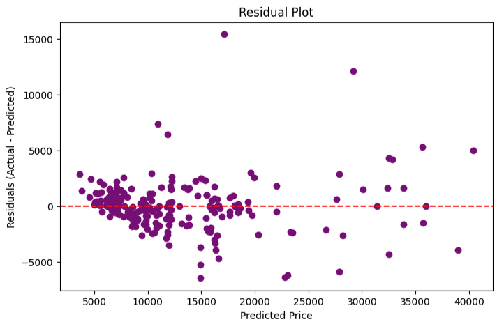
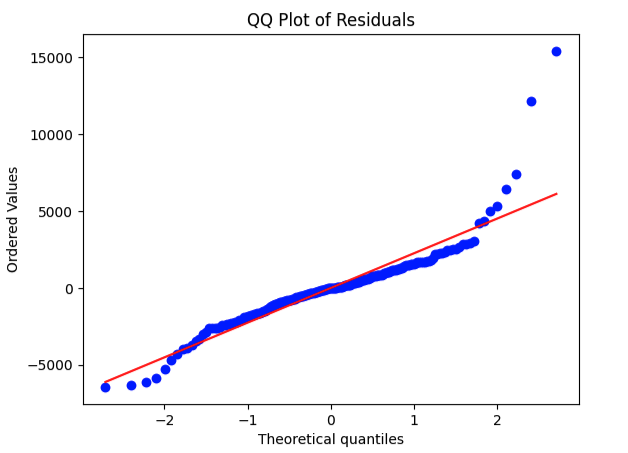

# 🚗 Car Price Prediction — Linear Regression Project

### 📋 Objective
Predict car prices using multiple linear regression enhanced by regularization (Lasso) to improve generalization and handle multicollinearity.
Goal: Identify which technical and brand features influence price the most while maintaining a stable, deployable model.

## 1️⃣ Data Preparation

- **Dataset:** 205 cars × 26 features  
- Removed unnecessary columns (`car_ID`)
- Fixed inconsistent brand names (`toyouta` → `toyota`, `vokswagen` → `volkswagen`)
- Extracted the **maker/brand** name from `CarName` into a new column `maker`

---

## 2️⃣ Encoding Categorical Variables

- Converted all categorical columns (`carbody`, `enginetype`, `fuelsystem`, `maker`, etc.)
  into numeric dummies using:

  ```python
  df_encoded = pd.get_dummies(df, drop_first=True)


## 3️⃣ Correlation Analysis

Computed full correlation heatmap
Observed that:

 - enginesize, horsepower, and carwidth ↗ strongly correlate with price
 - Many dummy variables were correlated among themselves (especially maker & fuelsystem)

 ## 4️⃣ Multicollinearity Check (VIF)
- Used Variance Inflation Factor (VIF) to detect redundant predictors:
- High VIF > 10 or inf → strong multicollinearity
- Dropped redundant variables:
    - car_ID
    - Repetitive dummy categories (e.g., redundant fuelsystems, enginetypes, duplicate makers, dummies)
- Re-evaluated until max VIF ≈ 6.6, indicating an acceptable level of collinearity.

 ## 5️⃣ Feature Selection (OLS)
 - Built initial OLS regression and examined:
    - Ran iterative OLS regressions to identify statistically significant predictors (p < 0.05).
    - Removed high p-value variables and those causing unstable coefficients.

From initially 68 features to 11:

horsepower, citympg, stroke, enginetype_ohc, drivewheel_rwd, 
carbody_hatchback, carbody_sedan, maker_bmw, maker_buick, 
maker_jaguar, maker_volvo, maker_toyota, maker_saab, maker_audi, ...

 ## 6️⃣ Regularization Models

**Ridge Regression**
```python
from sklearn.linear_model import Ridge
ridge = Ridge(alpha=1.0)
ridge.fit(X_train_scaled, y_train)
```

- Penalizes large coefficients, reducing multicollinearity impact.
- Balanced bias–variance tradeoff.

**Lasso Regression** (FINAL)
```python
from sklearn.linear_model import Lasso
lasso = Lasso(alpha=0.001)
lasso.fit(X_train_scaled, y_train)
```
- Performs feature selection by driving irrelevant coefficients to zero.
- Best generalization and interpretability.

 #### Final OLS Regression Lasso Results

| Metric   | Value         | Interpretation                                                                                         |
| -------- | ------------- | ------------------------------------------------------------------------------------------------------ |
| **R²**   | **0.881**     | Explains **88.1%** of all car price variation — very high explanatory power.                           |
| **RMSE** | **≈ 2751.43** | Average prediction error is only around **$2,750**, which is excellent given prices go up to ~$45,000. |

The direction of coefficients is logical (e.g., higher horsepower → higher price, higher brns reputation → higher price).


 ## 7️⃣ Models Cross-Evaluation

 | Model     | R²        | RMSE        | Comment                               |
| --------- | --------- | ----------- | ------------------------------------- |
| **OLS**   | 0.881     | 2751.43     | Strong but prone to multicollinearity |
| **Ridge** | 0.873     | 2805.12     | Slightly smoother coefficients        |
| **Lasso** | **0.871** | **2760.56** | Most stable, fewer features retained  |


 ## 8️⃣ Visualization

### Actual vs Predicted Prices
```python
plt.scatter(y, y_pred, color="blue")
plt.plot([y.min(), y.max()], [y.min(), y.max()], 'r-', linewidth=2)
plt.title("Actual vs Predicted Car Prices")
plt.xlabel("Actual Price")
plt.ylabel("Predicted Price")
plt.show()
 ```



 ### Residual Plot 
```python
residuals = y - y_pred
plt.scatter(y_pred, residuals, color="purple")
plt.axhline(y=0, color="red", linestyle="--")
plt.title("Residual Plot")
plt.xlabel("Predicted Price")
plt.ylabel("Residuals (Actual - Predicted)")
plt.show()
```



 ### QQ ResidualS Plot 
```python
import scipy.stats as stats
import matplotlib.pyplot as plt

# QQ plot
stats.probplot(residuals, dist="norm", plot=plt)
plt.title("QQ Plot of Residuals")
plt.show()
```



 ## 9️⃣ Predicting New Data
 
 ```python

 ```

  ## 9️⃣ Key Insights

- Horsepower: strongest technical factor driving price.
- Brand prestige (BMW, Jaguar, Buick) significantly boosts price.
- City mileage (citympg) inversely affects price — more efficiency means cheaper cars.
- Lasso reduced the number of active features, improving simplicity and preventing overfitting.


**Final Verdict:**

Metrics show a **very strong and efficient model**:

| Metric                 | Value         | Interpretation                       |
| ---------------------- | ------------- | ------------------------------------ |
| **R²**                 | **0.871**     | Explains 87% of price variance       |
| **RMSE**               | **≈ 2760.56** | Only ~$2.7k average deviation        |
| **Selected Algorithm** | Lasso         | Best balance between bias & variance |


## Summary
| Stage               | Status | Notes                           |
| ------------------- | ------ | ------------------------------- |
| Data exploration    | ✅      | Complete                        |
| Cleaning & Encoding | ✅      | Clean dataset                   |
| EDA & VIF           | ✅      | Solid multicollinearity control |
| Feature selection   | ✅      | Combined OLS + Lasso            |
| Regularization      | ✅      | Ridge & Lasso both tested       |
| Visualization       | ✅      | Clean and interpretable         |
| Deployment          | 🚀     | Streamlit UI built              |
